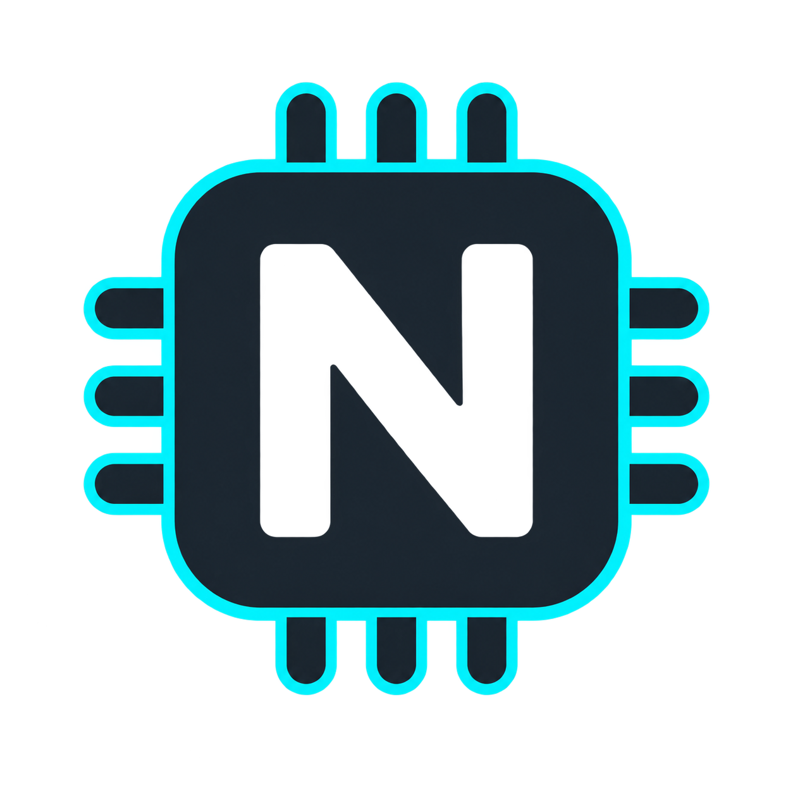
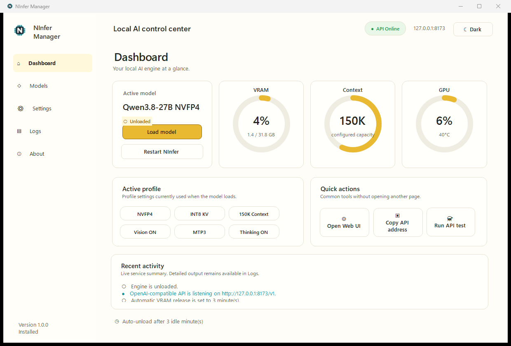
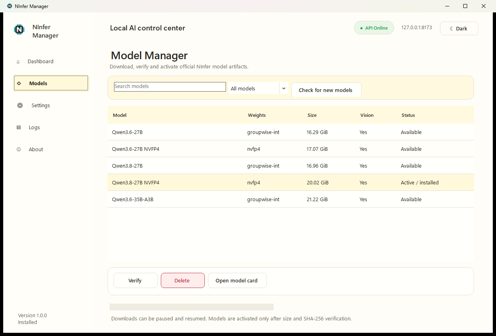
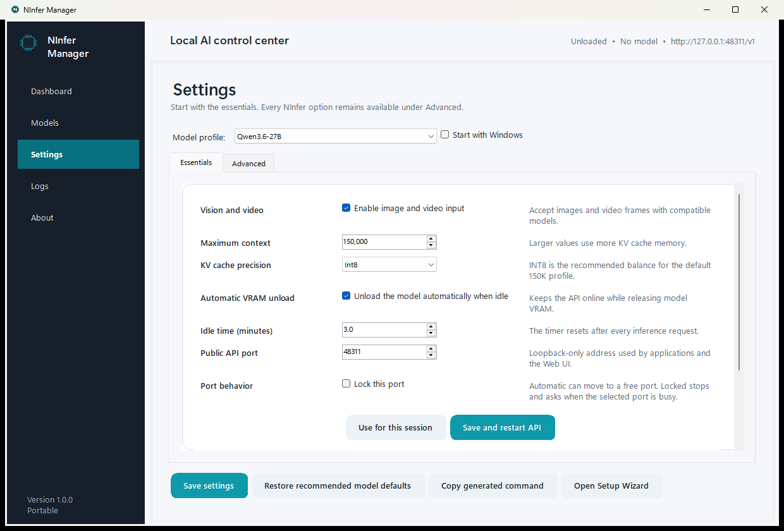
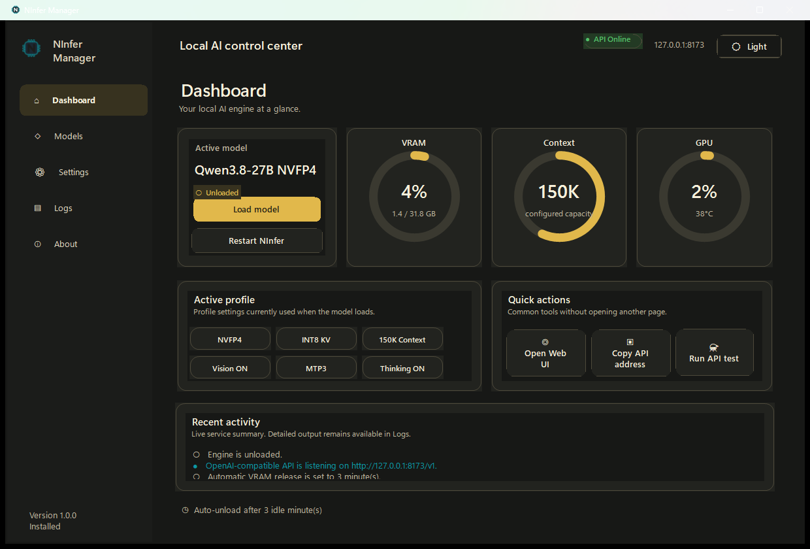

<p align="center"></p>
<h1 align="center">NInfer Manager</h1>
<p align="center">A Windows desktop app for managing and serving local NInfer models without using a terminal.</p>
<p align="center">
  <a href="https://github.com/BenGamliel/NInfer-Manager/actions/workflows/ci.yml"></a>
  <a href="https://github.com/BenGamliel/NInfer-Manager/releases/latest"></a>
  
  <a href="LICENSE"></a>
</p>

> [!IMPORTANT]
> NInfer Manager is an independent community project. It is not an official NInfer application and is not endorsed by the NInfer maintainers.



NInfer Manager packages a graphical controller around the native Windows build
of [NInfer](https://github.com/Neroued/ninfer). The Manager keeps a loopback API
available while no model is loaded, starts `ninfer-serve` when an inference
request arrives, and can unload the engine after a configurable idle period.

The inference engine is NInfer. The included browser interface is the unmodified
llama.cpp Web UI supplied by
[NInfer-windows](https://github.com/natpate/ninfer-windows); llama.cpp is **not**
used to load or run the model.

## Current compatibility

Version `1.0.0` contains NInfer-windows `0.5.0`, built specifically for the
following target:

| Requirement | Supported configuration |
|---|---|
| Operating system | Windows 11 x64 |
| GPU | NVIDIA GeForce RTX 5090 with 32 GB VRAM |
| CUDA architecture | `sm_120a` |
| NVIDIA driver | A driver compatible with CUDA 13.1 |
| CUDA Toolkit | Not required to run the packaged application |

This release does not include builds for RTX 3090, RTX 4090, RTX 5060 Ti or
other community NInfer forks. CPU offload and multi-GPU execution are not
supported by the bundled engine.

## Supported models

Models are not included in the Installer or Portable ZIP. The built-in catalog
contains these NInfer artifacts from the upstream model cards:

| Model | Weights | Download size | Image/video input |
|---|---|---:|:---:|
| [Qwen3.6-27B](https://huggingface.co/neroued/Qwen3.6-27B-NInfer) | Groupwise integer | 16.29 GiB | Yes |
| [Qwen3.6-27B NVFP4](https://huggingface.co/neroued/Qwen3.6-27B-nvfp4-NInfer) | NVFP4 | 17.07 GiB | Yes |
| [Qwen3.8-27B](https://huggingface.co/neroued/Qwen3.8-27B-NInfer) | Groupwise integer | 16.96 GiB | Yes |
| [Qwen3.8-27B NVFP4](https://huggingface.co/neroued/Qwen3.8-27B-nvfp4-NInfer) | NVFP4 | 20.02 GiB | Yes |
| [Qwen3.6-35B-A3B](https://huggingface.co/neroued/Qwen3.6-35B-A3B-NInfer) | Groupwise integer | 21.22 GiB | Yes |

The app can check the upstream NInfer model-card catalog for additions. A newly
discovered artifact is not guaranteed to work with the engine bundled in an
older Manager release; the app displays a warning before downloading it.

## Download

[Open the latest GitHub Release](https://github.com/BenGamliel/NInfer-Manager/releases/latest)
and choose one package:

- **Installer:** per-user installation with a Start Menu shortcut. Mutable data
  and models are stored under `%LOCALAPPDATA%\NInfer Manager` and are preserved
  when the application is uninstalled.
- **Portable ZIP:** extract it to a writable folder and run
  `NInfer Manager.exe`. Settings and models stay inside that extracted folder.

Both packages include the Manager, NInfer runtime, required runtime libraries
and Web UI. Neither package includes a model. The current binaries are not
digitally signed, so Windows SmartScreen may show an unrecognized-app warning.
The `v1.0.0` release includes `SHA256SUMS.txt` for manual verification.

## Quick start

1. Run the Installer, or extract and open the Portable package.
2. Use the first-run wizard to install and activate a model, or skip it and do
   the same later from **Models**.
3. Review the active model profile. The local API is already listening; the
   first inference request loads the model, or **Load model** can do it now.
4. Use **Open Web UI**, or connect a compatible client to the API address shown
   on the Dashboard.

No download starts without confirmation. A downloaded or imported artifact must
match the catalog size and SHA-256 value before it can be activated.

## What the application manages

- Start, unload and restart the NInfer process from the window or tray icon.
- Load the selected model automatically on the first inference request.
- Unload the model after an editable idle interval, or disable automatic unload.
- Download with resume support, import, verify and activate model artifacts.
- Move installed model files to the Windows Recycle Bin.
- Configure context capacity, Vision/video, shared K/V precision, concurrency,
  CUDA graphs, prefix reuse, speculative decoding, media limits, request queues,
  cache tiers, thinking behavior and sampling overrides.
- Detect a busy public port. Automatic mode selects an available port from the
  Windows dynamic range (`49152–65535`); Locked mode asks the user to choose.
- View logs and create a diagnostics ZIP with the configured API key redacted.
- Check GitHub Releases for Manager updates automatically or on demand.

The default public port is `8173`. Port changes can be applied for the current
session or saved for later launches.

## API surface

The Manager listens only on `127.0.0.1`; it does not expose the API directly to
the local network. These are the relevant routes provided by the bundled stack:

| Route | Support |
|---|---|
| `POST /v1/chat/completions` | OpenAI-compatible chat requests, including streaming, tools and media input when Vision is enabled |
| `POST /v1/responses` | NInfer's implemented core of the OpenAI Responses API; not full OpenAI platform parity |
| `GET /v1/models` | Active-model metadata; also available while the engine is unloaded |
| `POST /v1/messages` | Anthropic-compatible Messages requests |
| `GET /manager/health` | Manager and engine state on the local machine |
| `POST /v1/completions` | Not implemented |

Example base URL:

```text
http://127.0.0.1:8173/v1
```

The optional Manager API key protects `/v1` routes with an
`Authorization: Bearer <key>` header. The local `/manager/health` endpoint is not
protected. CORS can be enabled or disabled in Settings.

## Model profiles

For Qwen3.8-27B NVFP4, the tested recommended profile is:

| Setting | Value |
|---|---:|
| Context and KV capacity | 150,000 tokens |
| Vision and video | Enabled |
| KV precision | INT8, shared by K and V |
| Speculative decoding | MTP with 3 draft tokens |
| CUDA graphs | Enabled |
| Prefix reuse | Enabled |
| Automatic unload | 3 idle minutes |

These values are editable. NInfer exposes one precision option shared by K and
V, so the Manager does not present separate K and V precision controls. DFlash
is exposed only as an engine option; in the bundled runtime it is applicable to
text-only Qwen3.6-35B-A3B execution, not to the profile above.

## Interface

| Model Manager | Essentials and Advanced settings |
|---|---|
|  |  |

<details>
<summary>View the Dark theme</summary>



</details>

## Verified QA scope

The recorded functional QA run used Windows 11, an AMD Ryzen 9 9950X3D, an RTX
5090 32 GB and Qwen3.8-27B NVFP4 with 150K context, INT8 KV and Vision enabled.
It covered text and image requests, 150K KV allocation, automatic unload,
backend cleanup, Portable startup, silent installation and uninstall.

During that run, the Manager working set settled at 7.7 MiB while hidden in the
tray. Approximately 28 GB of total GPU memory was observed while the model was
loaded. These are observations from one machine and are not general performance
or throughput claims. The exact environment, results and pending test areas are
listed in [Benchmarks and QA](docs/BENCHMARKS.md).

## Privacy and network access

The Manager has no telemetry or user account. It contacts GitHub for catalog
refreshes and release checks, and Hugging Face for model downloads. **Open model
card** launches the corresponding Hugging Face page in the default browser.
Automatic catalog and update checks can be disabled. Logs and settings remain
in the local data directory.

## Documentation

- [User guide](docs/USER_GUIDE.md)
- [Architecture and security boundaries](docs/ARCHITECTURE.md)
- [Benchmarks and QA scope](docs/BENCHMARKS.md)
- [Publishing checklist](docs/PUBLISHING.md)
- [Contributing](CONTRIBUTING.md)
- [Security policy](SECURITY.md)

## Build from source

Building the Manager requires the .NET 10 SDK. Creating the full distribution
also requires Inno Setup 6 and a compatible NInfer-windows portable release.

```powershell
./scripts/build.ps1 -EngineSource "D:\path\to\ninfer-windows-release"
```

The packaging script excludes `.ninfer` model artifacts and partial downloads.
Run `./scripts/audit-repository.ps1` before publishing.

## Credits and license

NInfer Manager was created and is maintained by **Ben Gamliel** and is licensed
under the [Apache License 2.0](LICENSE).

NInfer, NInfer-windows, the llama.cpp Web UI, model artifacts and runtime
libraries remain the work of their respective authors and retain their own
licenses and notices. See [Third-Party Notices](THIRD-PARTY-NOTICES.txt) for
attribution and source links. Review each model card before downloading an
artifact.
